# Third Mind Reader

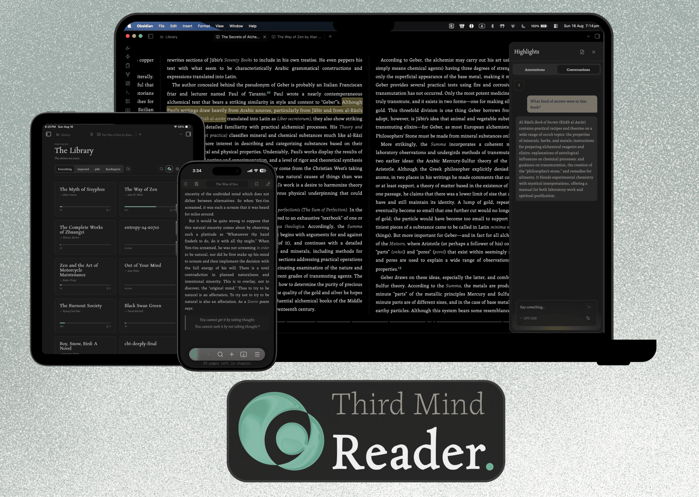

An opinionated EPUB & PDF reader for Obsidian. Books open as tabs like anything else in your vault, designed to be minimal and unobtrusive to ensure the reading experience stays front and centre, and every highlight you make is written straight into a plain markdown note just like any other note in your vault.

> **How this was built:** the code here is largely AI-generated and directed by me — [see below](#how-this-was-built).

## Why this exists

Most reading setups scatter your thinking. You read in one app, take notes in another, and the ideas you actually cared about end up spread across formats you'll never open again. It gets messy quickly; ask me how I know.

Third Mind Reader keeps all of it in one place. Your highlights and annotations become a companion note the moment you make them: tagged, linked back to the book, visible in graph view. Nothing to sync, nothing to export. If you uninstalled the plugin tomorrow, every note you'd made would still be sitting in your vault as ordinary markdown.

## Design approach

Third Mind Reader is a tool to help you capture thoughts as you read, and answer questions without needing to break the reading flow. Its aesthetics are also designed to be warm and literary; it should carry the same character as the smell of a page or the quiet anticipation of a library. Your thoughts need **space** to emerge, and the design is built to accommodate for this.

I thought the act of annotation can look different too, with the technologies available to us now. Which is why I created the Gloss Bar to enable some interesting interactions and capture thoughts in the best way when annotating. If you'd prefer to only annotate, Lite mode keeps the experience simple and AI-free.

Everything follows my design system; I'm a designer by trade, and spent a lot of time curating the experience. While the design is opinionated, that doesn't mean it's rigid. Look for the 3C logo in the library and the reader, where you can toggle my styling or use your Obsidian's settings and themes.

## Reading

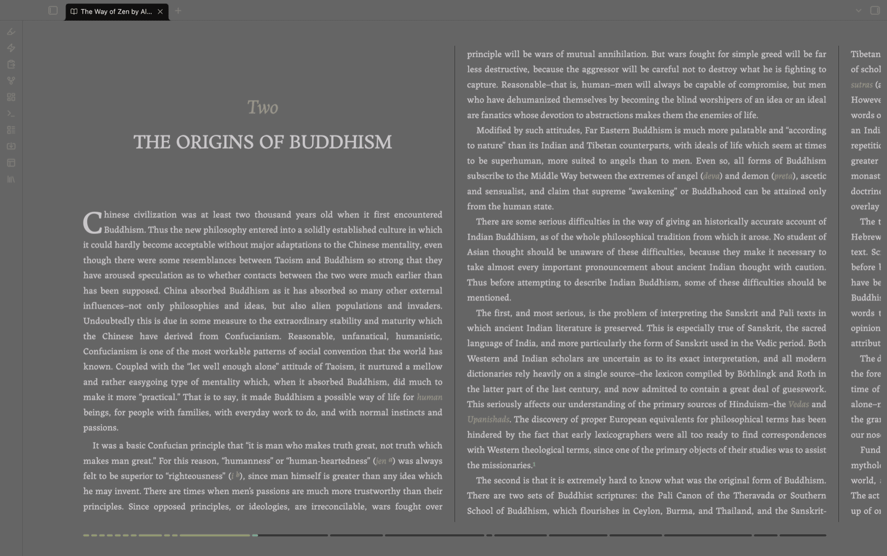

A two-page spread or a single page, depending on the window size you prefer. It's got all the standard bells & whistles: chapter navigation, table-of-contents panel, in-book search across the whole book, a live progress bar, and per-book position memory so you come back where you left. Body text follows Obsidian's own text size, but you can override this in the settings.

The source EPUB is never modified.

## Gloss — The Annotation Layer

Select any text and a small toolbar appears. The name derives from the medieval scholarly practice of _glossing_; of annotating manuscripts between the lines and in the margins. This interaction is the heart of the whole thing, and the reason I built this reader.

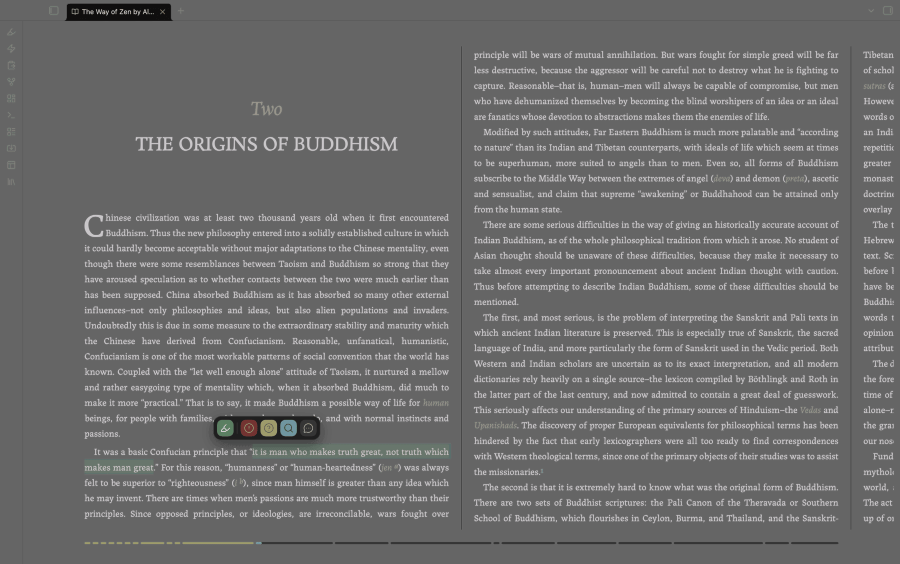

What the toolbar offers depends on whether you've set up an AI provider. With one, there are five modes:

| | Mode | What it does |
| --- | --- | --- |
| `1` | Emphasise | A plain highlight with your own note. No AI. |
| `2` | Exclaim | Captures your reaction, and opens it as a conversation |
| `3` | Explain | Asks for a quick clarification of the passage |
| `4` | Examine | Digs deeper, with citations |
| `5` | Enquiry | Opens an open-ended back-and-forth |

**If you don't want AI anywhere near your reading, you don't have to have it.** AI is off until you add a provider, and with it off the reader runs in Lite mode: the toolbar offers Emphasise alone, and the annotations pane drops its conversation tab. You get a clean highlighter and a notes file, and the plugin doesn't bother you about any AI stuff. Add a provider and the other four modes appear.

You can type `[[` while annotating and get the same file suggestions you'd get anywhere else in Obsidian, which makes connecting a passage to something already in your vault about as frictionless as it gets. Easy breezy.

## Companion notes

One note per book, created on your first annotation and filed in an Annotations folder inside whichever folder you use as the Library. Frontmatter, tags, and a wikilink back to the source file. Each annotation is a colour-coded callout carrying the quote, your note, and — if you used an AI mode — the full exchange written out verbatim.

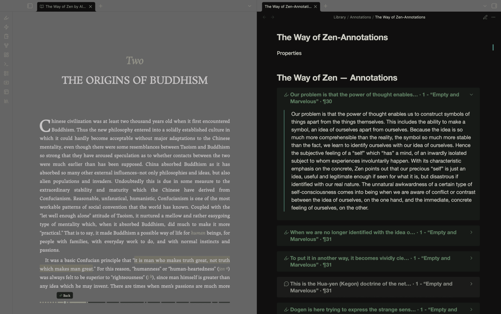

They're first-class vault notes from the moment they exist, so your reading feeds the same graph as everything else you think about. Also, a fun side effect is that you can share your annotations with other readers who use the plugin and read the same book/file; all your annotations will appear for them just the same!

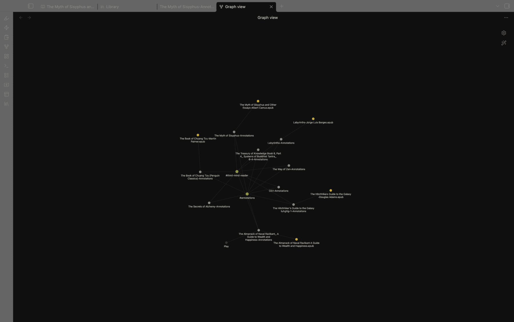

## The annotations pane

A slide-in panel listing every highlight in the book, grouped by chapter. Click one to jump straight to it.

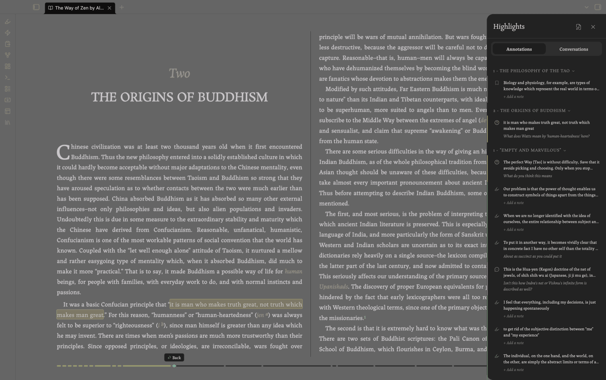

Anything AI-bearing gets its own tab, where the conversation unfolds in place — pinned quote, chat, model picker.

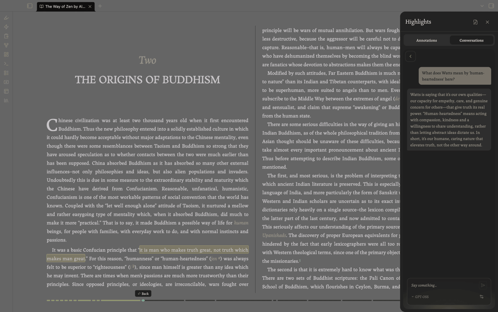

**Local first.** Point it at Ollama or LM Studio and nothing ever leaves your machine. Cloud providers (Anthropic, OpenAI, OpenRouter) work too if you'd rather, with your own key. Either way, the whole exchange goes to the companion note rather than being trapped in a chat window somewhere.

## Bookmarks

Mark any page. A bookmark is an annotation with no text range: so same annotation note, same list.

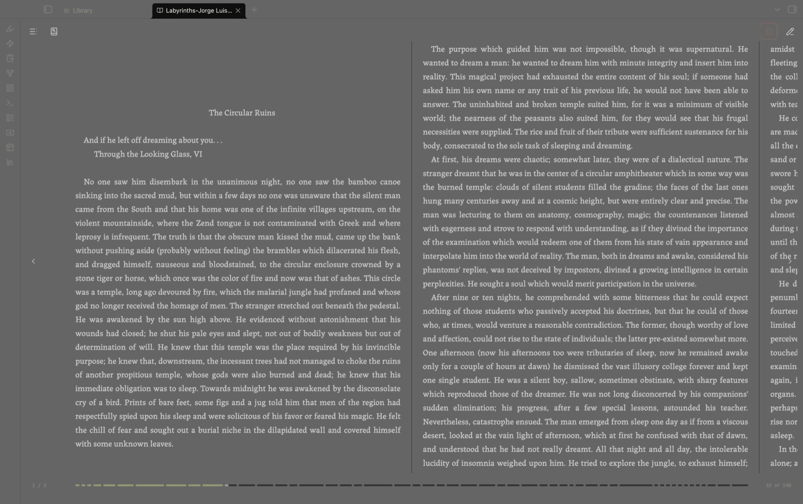

## PDFs

The same Gloss toolbar works inside Obsidian's own PDF viewer. Annotations anchor as standard Obsidian PDF deep links, so they behave properly with graph, search, and other PDF plugins. PDFs show up in the Library alongside your books.

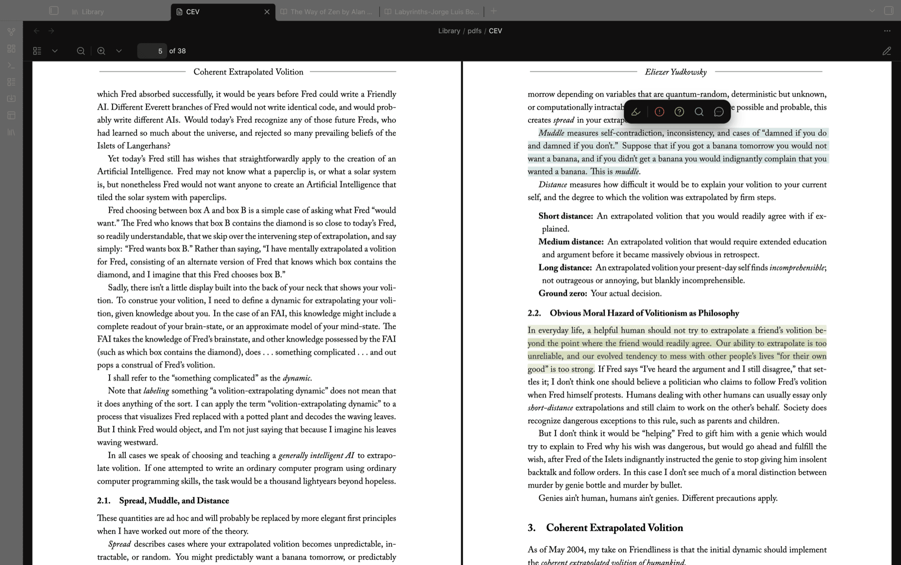

## The Library

A shelf of every book and PDF in your Library folder, with reading progress and annotation counts, current reads sorted to the top, and subfolders as collections. The first time you enable the plugin it asks where your library is: point it at a folder you already keep books in, or let it make one for you.

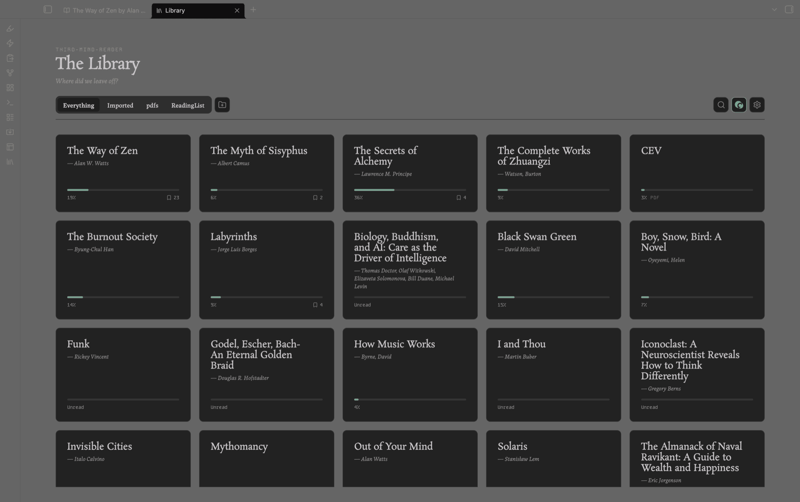

## Mobile

The full reader on phones and tablets. Tap the edges to turn pages, tap the middle for controls, everything sized for touch.

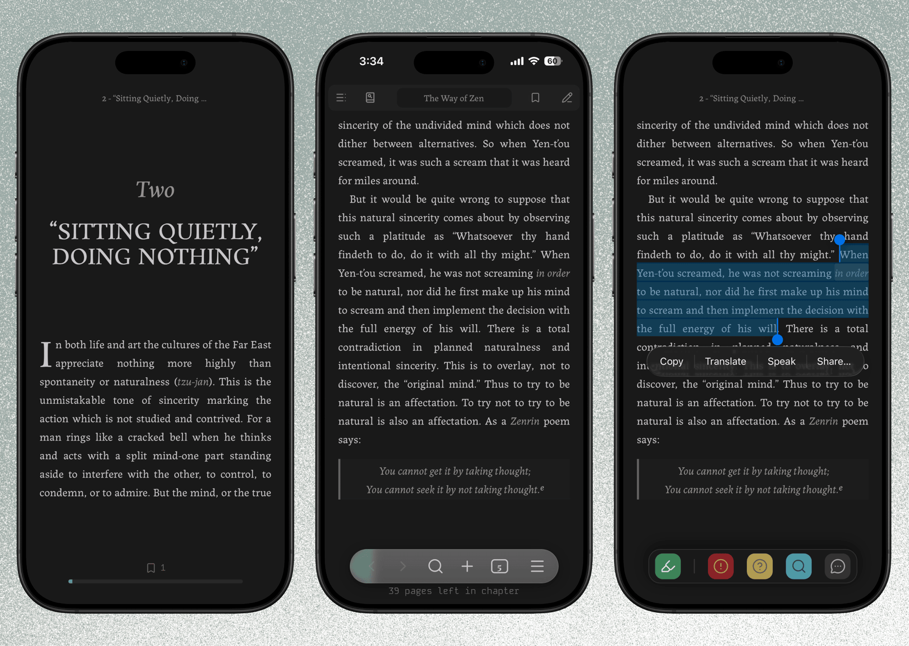

Tablets get an experience close to the desktop one; phones get a layout built for them.

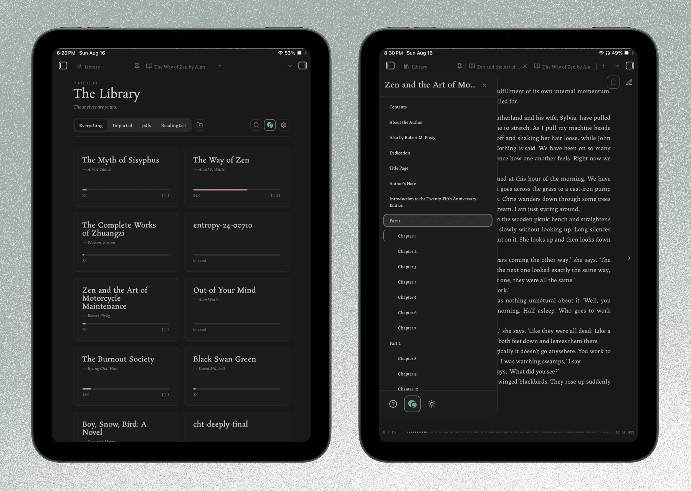

If you'd rather keep inference local but read on your phone, turn on deferred AI: your questions are saved into the companion note as you read, and answered automatically by your local model the next time that book opens on desktop.

## Install

1. In Obsidian, go to **Settings → Community plugins → Browse**.
2. Search for **Third Mind Reader** and install it.
3. Enable it.
4. Open any `.epub` in your vault to start reading — or select text in a PDF to annotate it.

## Keys

A cheat sheet — **"How to use the reader"** — opens the first time you open a book. To bring it back: the **?** button at the bottom of the table-of-contents panel, or the command palette.

| Key | Action |
| --- | --- |
| `←` / `→` | Previous / next page |
| `t` | Table of contents |
| `h` | Highlights & annotations pane |
| `b` | Create or remove a bookmark |
| `s` | Search in book |
| `1`–`5` | Gloss mode (while text is selected) |
| `Esc` | Close a panel, or dismiss the Gloss toolbar |

On mobile, tap the left or right edge to turn the page and the middle to reveal the controls.

## Requirements & disclosures

- **Desktop and mobile.** Phones and tablets are fully supported, though Android has seen less testing than iOS — reports welcome. Importing books from outside the vault is desktop-only (it uses Node/Electron APIs mobile doesn't have); books already in your vault open anywhere.
- **DRM-free books only.** Encrypted EPUBs (Adobe DRM, Readium LCP) are detected and refused with an explanation rather than opening as garbage. This won't change; LCP decryption needs a certified licensee key an open-source plugin has nowhere to keep. Font-obfuscated books (common in InDesign exports) are unaffected and open normally.
- **Network use is optional.** AI features send the text you select plus your prompt to the provider you configure. **No network request is made unless you actively use an AI feature.** No telemetry, no ads.
- **API keys.** Cloud providers need your own key, entered in settings and held in Obsidian's encrypted secret storage. Local models need none of course.
- **Your data.** Annotations are written to companion notes in your vault. The source EPUB is never touched.
- **Pop-out windows.** The reader works in Obsidian's main window; a book moved into a pop-out window says so and offers to move itself back. Full pop-out support is on the list.

## How this was built

The code in this repository is largely AI-generated. I directed it: architecture, specs, review, and a lot of testing and fine tuning. I wrote very little of the TypeScript by hand.

What I authored is the part I'm actually qualified for — the product and system design, the interactions, the reading experience, and the design language underneath it. Most features started as a written spec before any code existed, and the visual system predates the plugin entirely. So while the implementation is generated, **the decisions are mine, as is the responsibility.**

I'm saying this up front because you should know it before installing something, and in the spirit of FOSS you should know how a thing was made.

What that means in practice:

- **I'm still learning.** I understand how the codebase fits together, and that understanding has already fixed real bugs. I won't be as fast as a maintainer who wrote every line, but I intend for the code to keep getting better.
- **Bug reports are genuinely useful.** I'd much rather hear about a problem than not.
- **Fork it.** It's AGPL-3.0. If you'd do this better, please do.

Building this has given me a new appreciation for how professionals write software, and I'm still working out what doing it properly looks like.

## Credits & licensing

- Licensed under **AGPL-3.0-or-later** — see [LICENSE](LICENSE).
- Built on [jszip](https://stuk.github.io/jszip/) (MIT), [@chenglou/pretext](https://github.com/chenglou/pretext) (MIT), and [DOMPurify](https://github.com/cure53/DOMPurify) (MPL-2.0 / Apache-2.0).
- Bundled fonts: Rosarivo, Labrada, Kode Mono (SIL Open Font License).
- If you build your own reader on this code, a one-line credit to **Third Mind Reader** is appreciated. "Third Mind Reader" / "TMR" is a held name — please rename your fork, thanks.

## Contributing

I'm not looking for external contributions at the moment, but I'd encourage you to **fork it and make the reader yours**. Suggestions and bug reports are welcome via issues, or the feedback button in the plugin settings.

If you're feeling generous, you can send me a little tip here:

